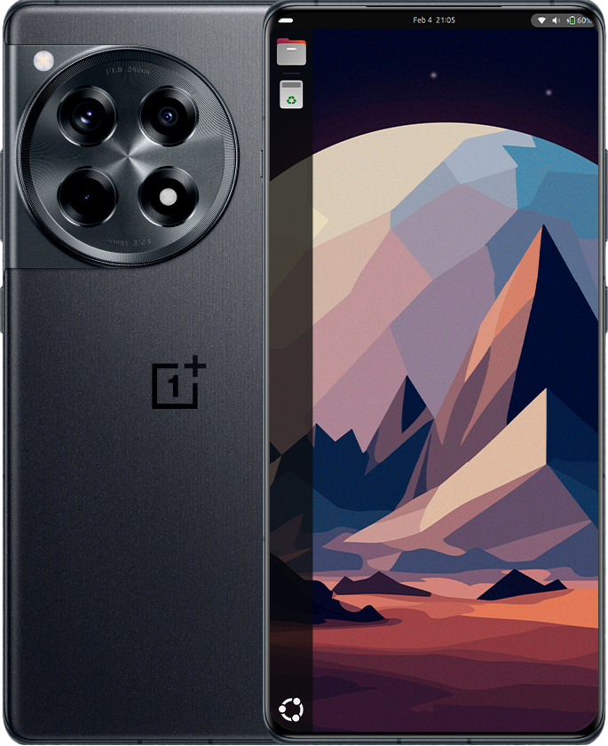

```
╔═══════════════════════════════════════════════════════════════════════════════════════╗
║                     ⚠️  TERMONÜKLEER UYARI  ⚠️                              ║
║                                                                              ║
║  Bu projeyi kullanarak aşağıdaki riskleri kabul etmiş sayılırsınız:          ║
║                                                                              ║
║  • 📱 Telefonunuzun tuğlaya dönmesi (brick)                                 ║
║  • 💾 Tüm verilerinizin silinmesi                                            ║
║  • 🔥 Termonükleer savaş çıkması                                             ║
║  • ⏰ Alarm çalmadığı için işten kovulmanız                                  ║
║  • 💳 Garantinizin tamamen geçersiz kalması                                  ║
║  • 👻 Telefonunuzun hayalet dosyalarla dolması                               ║
║  • 🚗 Arabayla giderken cihazınızın kendi kendine reboot atması              ║
║  • ☕ Kahvenizin soğuması                                                    ║
║                                                                              ║
║  BU PROJEYİ KULLANARAK YAPTIĞINIZ TÜM DEĞİŞİKLİKLERİN SORUMLULUĞU           ║
║  TAMAMEN SİZE AİTTİR.                                                        ║
║                                                                              ║
║  Eğer cihazınızı mahvederseniz, parmağınızı bize doğrultup                    ║
║  suçlamaya kalkarsanız, sadece güleriz. 😂                                   ║
║                                                                              ║
║  Yeterli araştırmayı yapmadan, ne yaptığınızı bilmeden,                       ║
║  bu işlemlere BAŞLAMAYIN.                                                    ║
║                                                                              ║
║  YOU HAVE BEEN WARNED.                                                       ║
╚═══════════════════════════════════════════════════════════════════════════════════════╝
```



# Ubuntu for OnePlus 12R / Ace 3 (aston)

> ⚠️ **DISCLAIMER**: This project is provided as-is, without any warranty. The authors are not responsible for any damage, data loss, or voided warranties. Use at your own risk.
> 
> This build was produced by an **AI agent** (opencode/big-pickle). Human involvement was limited to following instructions and providing device access.

## Credits

This project is a fork of [jiganomegsdfdf/ubuntu-oneplus-aston](https://github.com/jiganomegsdfdf/ubuntu-oneplus-aston) — massive thanks to the original developer for the kernel, firmware squashing, and ALSA work.

## Status

⚠️ **No dualboot yet** — only Ubuntu on slot B works. Slot A is not restored.

## Prerequisites

- OnePlus 12R / Ace 3 (CPH2609, codename "aston")
- Unlocked bootloader
- TWRP recovery installed (can be on `recovery` or patched `init_boot`)
- ADB & Fastboot on your PC
- Enough free space (~70 GB recommended for Ubuntu)

## Partition Layout

| Partition | Size | Filesystem | Content |
|-----------|------|------------|---------|
| `super` | 16.6 GB | - | Android system |
| `userdata` | ~164 GB | f2fs | Android data |
| `win` | ~70 GB | ext4 | Ubuntu rootfs |

- **Slot B**: Ubuntu (uses `boot_b` + `win` partition)
- **Slot A**: Currently broken (needs stock firmware restore)

## Installation

### 1. Repartition (WARNING: wipes Android data)
Use `parted` in TWRP:
```
adb push parted /tmp
adb shell
chmod +x /tmp/parted
/tmp/parted /dev/block/sda
print               # note userdata start/end
rm <userdata_num>   # delete userdata
mkpart userdata f2fs <start> <new_end>
mkpart win ext4 <new_end> <original_end>
quit
```
Then format:
- Format userdata as f2fs in TWRP
- `mkfs.ext4 /dev/block/by-name/win`

### 2. Flash rootfs
```
adb push rootfs.img /tmp/   # needs ~7 GB free in /tmp
adb shell dd if=/tmp/rootfs.img of=/dev/block/by-name/win
```

### 3. Flash boot image
```
adb shell dd if=/tmp/boot.img of=/dev/block/by-name/boot_b
```

### 4. Boot Ubuntu
```
fastboot set_active b
fastboot reboot
```

## Switching Back to Android
```
fastboot set_active a
fastboot reboot
```
First boot after wipe will show setup wizard.

## Building from Source

### Firmware Extraction
Firmware blobs are not included in the repo (some exceed GitHub's 100 MB limit).
Use the extraction script to get them from your device or stock firmware:

```
# Option 1: Extract from device via ADB (phone must be booted with root)
./extract-firmware.sh --device -a 14

# Option 2: Extract from stock OxygenOS ZIP
./extract-firmware.sh --zip ~/Downloads/OnePlus-12R-CPH2609.zip -a 14

# Option 3: Use an already-extracted firmware directory
./extract-firmware.sh --firmware-dir ~/firmware_dump -a 14

# For Android 15 (ColorOS 15), use -a 15 instead
```

This builds `firmware-oneplus-aston-a14.deb` (or a15).

### Build Pipeline
Run the scripts in order:
```
./aston-kernel_build.sh      # builds kernel, boot.img, linux .deb
./aston-fw_squasher-a14.sh   # or use extract-firmware.sh instead
./aston-rootfs_build.sh      # builds rootfs.img
./aston-rootfs_package.sh    # installs .deb packages into rootfs
```
